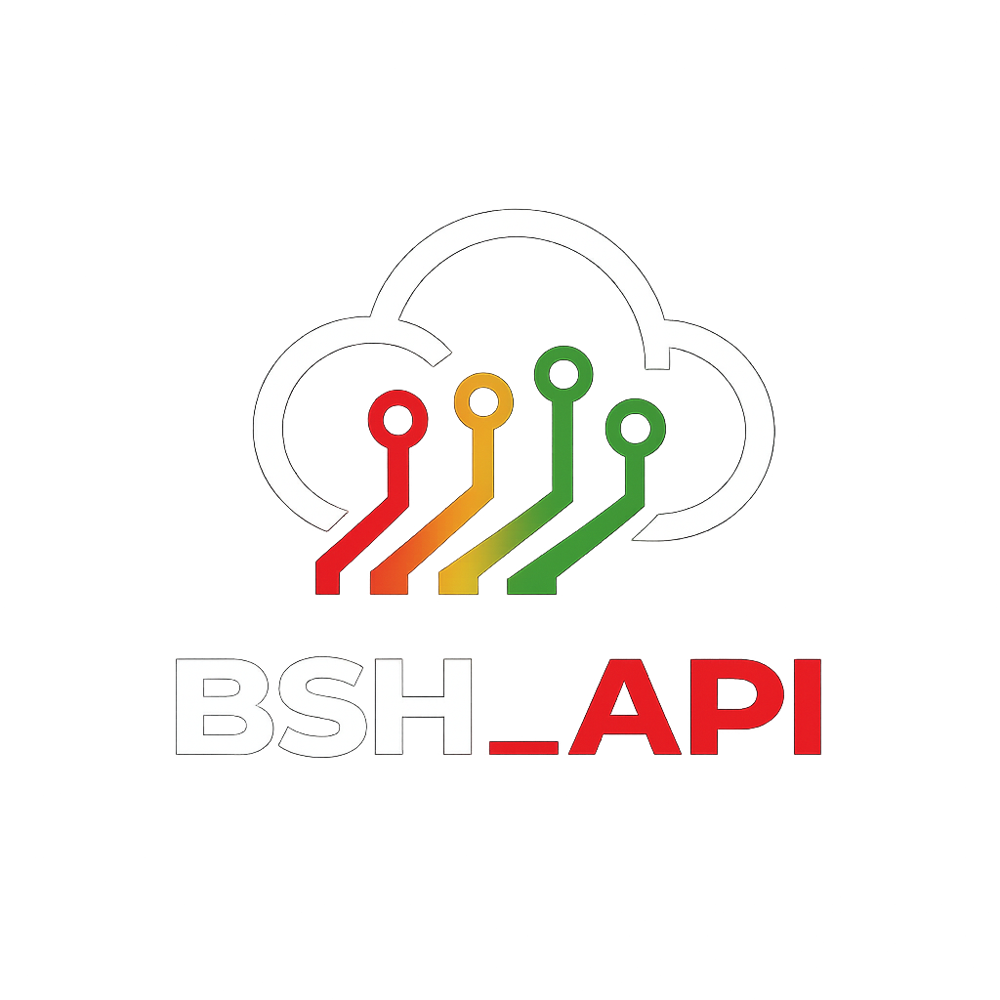

# BSH-API




> Uma API simples feita 100% em Rust com foco em gerenciar usuários e posts de um fórum.

### Ajustes e melhorias

O projeto está pronto para o uso mas ainda pendente para as seguintes melhorias:

- [ ] Implementação de CORS
- [ ] Implementação de Rate-limit para o envio de posts e cadastro de usuários


## 💻 Pré-requisitos

Antes de usar, verifique se você atendeu aos seguintes requisitos:

- Você instalou a versão mais recente de `rustc e do Cargo`
- Você leu a [DOCUMENTAÇÃO](doc.md).

## 🚀 Instalando BSH-API

Para instalar a BSH-API, digite no terminal:

Linux / Windows:

```
git clone https://github.com/batata902/bsh-api
```

## ☕ Usando BSH-API

```
cargo run
```

A api iniciará sua execução, escutando em 0.0.0.0 na porta 9090

Se desejar especificar o ip e a porta você pode usar:

```
cargo run -- [--ip/-i] <ip> [--port/-p] <port> 
```

##

Esse projeto está sob licença. Veja o arquivo [LICENÇA](LICENSE.md) para mais detalhes.